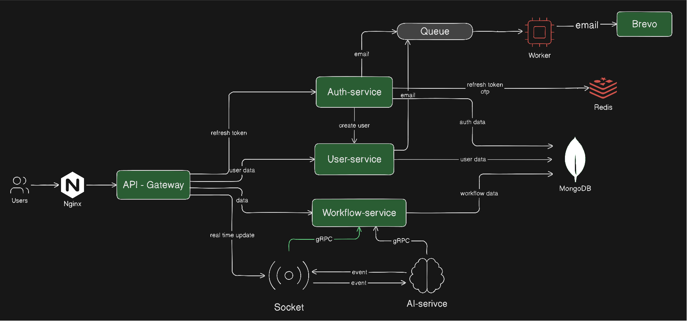

<div align="center">

# 🧠 Time Table Generator

### AI-Powered Scheduling Platform • Microservices • Real-Time Workflows



<br/>


</div>

---

# ⚡ Overview

Time Table Generator is a scalable AI-powered scheduling platform designed to automate complex timetable generation workflows using intelligent conflict resolution, event-driven architecture, and real-time synchronization.

The platform combines:
- 🧠 AI scheduling workflows
- ⚙️ Microservices architecture
- 📡 Real-time communication
- 🔥 Background job processing
- 🚀 Scalable backend systems

---

# ✨ Core Features

<table>
<tr>
<td width="50%">

## 🧠 AI Scheduling
- LangChain workflows
- LangGraph orchestration
- Conflict-aware generation
- Intelligent scheduling pipelines

</td>
<td width="50%">

## ⚡ Real-Time System
- WebSocket synchronization
- Live workflow updates
- Event-driven communication
- Reactive UI updates

</td>
</tr>

<tr>
<td width="50%">

## 🔐 Authentication
- JWT authentication
- Refresh tokens
- OTP verification
- Secure session handling

</td>
<td width="50%">

## ⚙️ Scalable Infrastructure
- Redis worker queues
- Docker deployment
- API Gateway architecture
- Background processing

</td>
</tr>
</table>

---

# 🏗️ Architecture

```text
Users → Nginx → API Gateway → Services → Database / AI / Queues